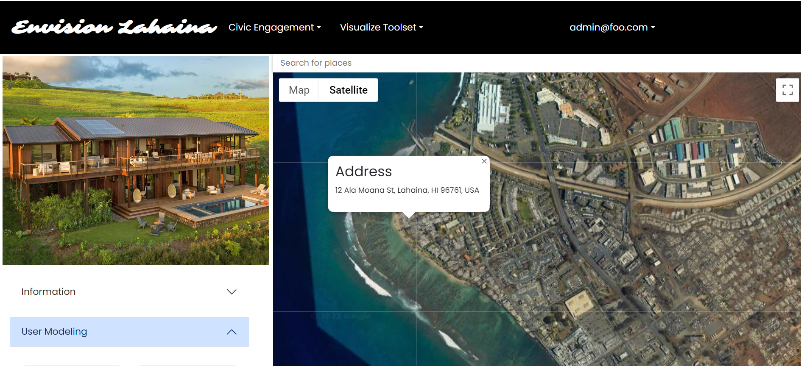
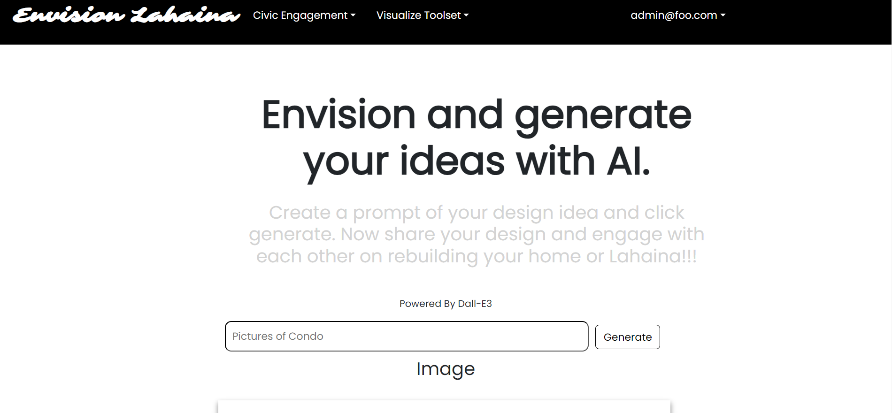

### Related Links

(Website Link)
- https://envisionlahaina.com/

(Project Page)
- https://envision-lahaina.github.io/envision-lahaina-/

(Organization Page)
- https://github.com/envision-lahaina

### My Contribution
- Front-End: Build out entire structure of website utilizing React, Boostrap, HTML, CSS
- Back-end: Design MongoDB database, create API calls and connecting to front end

### My experience

- I had an blast working on this project and presenting at HACC 2023. The two week i spend working on this project help me realized the amount of material and new tech I can absorb in a short amount of time. It is about whether you have the drive to learn and the passion to create a project you are proud of. 
- Through the process of completing this project, I've experienced many challenges, one of them being image upload. If we directly store image upload onto our MongoDB it would be oversize and very inefficient, also will not preventing malicious files upload. Through hours of research, than I was able to figure out a solution, which was using an external cloud and store a secure link returned by the external cloud, allowing us to store image in a safe and efficient way.

## Sample Features

#### Landing Page

The landing page for any new visitors or user who have not logged in yet. Vistior have options to sign up or sign in.

#### Home Page

The Home Page is the first page that users will see when they Login, no other feature will be accessible unless user is signed in

#### Forum

Forum consists of posting, commenting, searching base on titles, and viewing your own post by click on my posts.

#### Survey

Survey page allows creating, voting and searching for an specific surveys base on contents. User are limited to voting once per survey to ensure fair and accurate results.

#### Community

User have an option to add, edit or delete their profile. This is a page demonstrating profiles of all users who choose to add one.

#### Map-Modeling

Collaborative Platform allowing user to add their design concept. Ping or search any location to view other or add your own design concepts!

#### Generative-AI

Generative AI powered by Dall-E3, user give a prompt regarding their design or to envision Lahaina, then it will return a Image generated by AI in seconds. User also guaranteed 100% right to image generated.

#### Gis Map

Embedded Gis Map with data visualization and 360 VR of scenes in Lahaina.

#### External

External Resources for user to learn more about Lahaina and access useful resources.

#### Text Moderation

24/7 Admin free text moderation on all text-related contents on website.

#### Additional Feature

- Sign-in/up/out
- Add/Edit/Delete Profile

